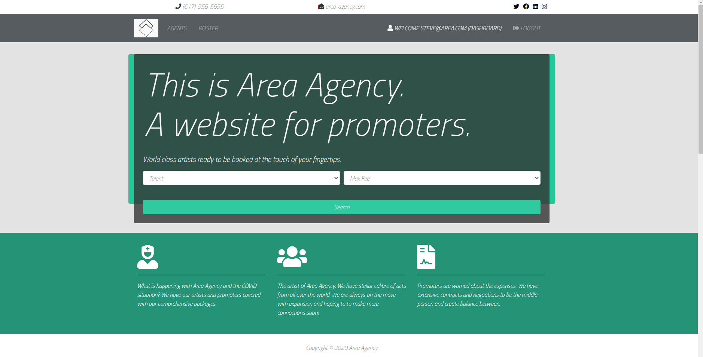
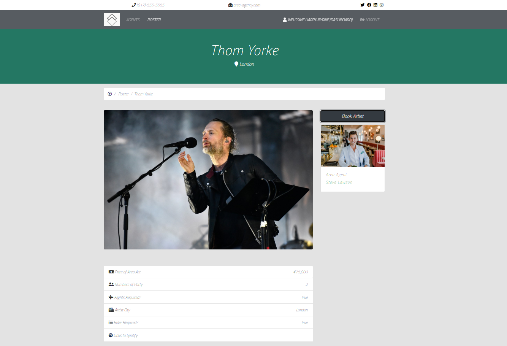
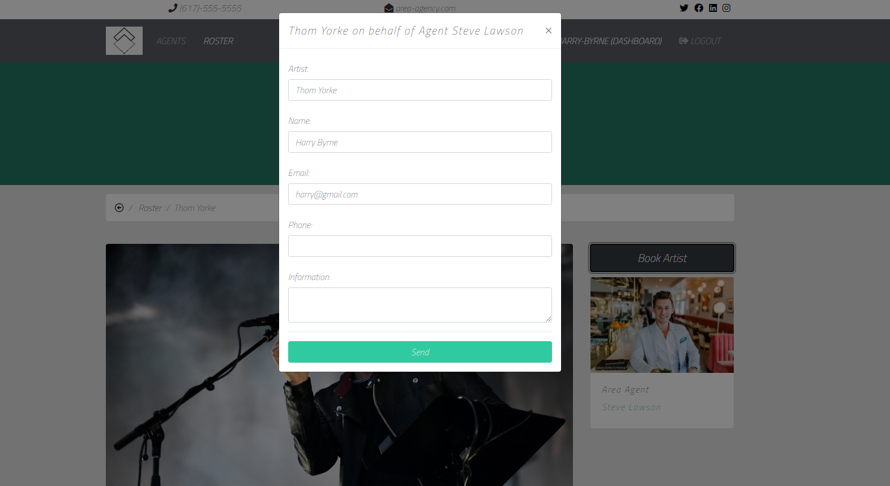
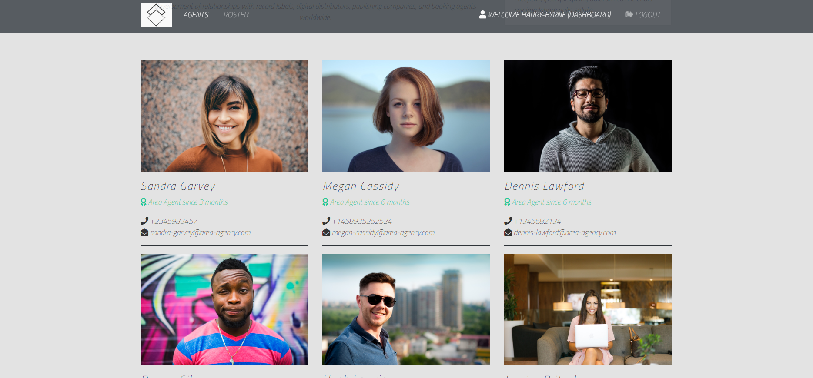
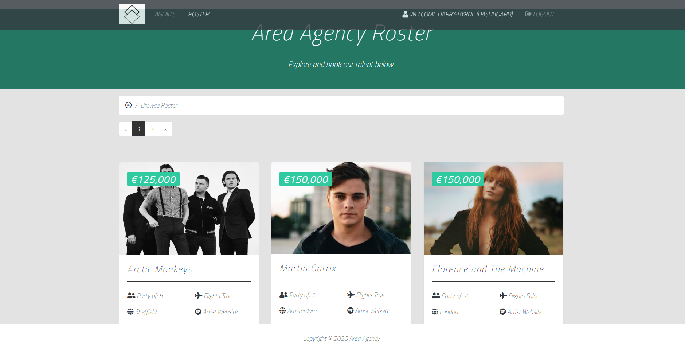

# areaAgency
College project version for Area Agency application. A promoters niche website allowing you to book and enquire musical talent.
 

http://areaagency.live/

# Documentation
https://www.djangoproject.com/  
https://jinja.palletsprojects.com/en/2.11.x/

# Tools and Technologies Used
Django  
Postgres (phpMyAdmin)  
Bootstrap4  
JQuery  
SCSS Files  

# Installation and Used Commands
<code>python manage.py runserver</code>
-runs the server

<code>python manage.py runmigrations</code>
-transfer the model data over to postgres

<code>python manage.py startapp pages</code>
-Creates a new pages app

<code>python manage.py collectstatic</code>
-shows a static folder in the root

<code>python manage.py startapp artists</code>
-created a artists app (needs a urls.py)

<code>python manage.py startapp agents</code>
-creates a agents app (needs a urls.py)

<code>python manage.py migrate</code>
-Check postgres database to see if it's active and running

<code>python manage.py makemigrations</code>
-Attempt to enter fields into models and then pass them Postgres

# Deployment Stage 
https://www.nginx.com/  
https://www.digitalocean.com/  
https://gunicorn.org/  

https://www.digitalocean.com/community/tutorials/how-to-set-up-django-with-postgres-nginx-and-gunicorn-on-ubuntu-16-04

# Image Bank

